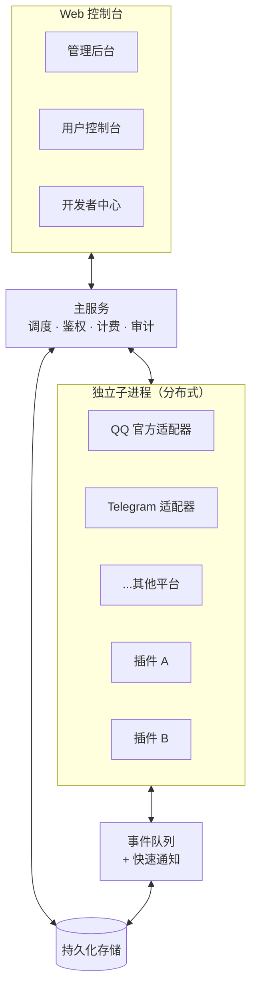

# 系统架构

> **你会了解到**：V3 的整体结构、事件如何在系统里流转、各模块如何协作。

## 总体结构

V3 由一个**主服务**统一调度，下面挂着若干**适配器子进程**和**插件子进程**，前端是一个 Web 管理控制台。

主服务负责：用户鉴权、订阅计费、权限校验、审计日志、调度子进程、对外提供 API。
适配器和插件作为子进程独立运行，通过**事件队列**与主服务协作。

## 事件流转

当一条消息从平台（比如 QQ）到达，到插件处理完回复出去，经历这样的流程：

几个关键设计：

- **标准化**：适配器把各平台的原始事件统一成 [XUBP 格式](../xubp/overview)，插件只面对统一格式，不感知平台差异。
- **持久化队列**：事件先落盘存储，保证即使进程重启也不丢事件。
- **快速通知**：事件入队后，通过 Redis 的流式通知立即唤醒处理进程，延迟极低；Redis 不可用时自动降级为数据库轮询，功能不中断。
- **抢占式认领**：多个 Runtime 进程竞争处理事件，谁先拿到锁谁处理，天然支持横向扩展。
- **过滤**：事件入队前会经过机器人的设置过滤（比如忽略其他机器人发的消息、忽略 @全体等），减少无效处理。

## 进程模型

| 进程类型 | 职责 | 隔离方式 |
|---------|------|---------|
| 主服务 | 调度中枢、Web 服务、鉴权计费 | 单进程 |
| 适配器 Runtime | 连接一个平台、收发该平台的消息 | 每适配器独立子进程，可多节点 |
| 插件 Runtime | 执行插件代码、处理事件 | 每插件独立子进程 |

::: tip 为什么用子进程
子进程隔离带来三个好处：① 插件崩溃不影响主服务和其他插件；② 可以限制单个插件的资源占用；③ 天然支持把不同插件分布到不同机器上扩展。
:::

## 数据隔离

多租户隔离贯穿整个数据层：

- 机器人实例归属于某个用户（租户）。
- 插件的运行数据（`data_store`）按 `插件 + 用户 + 机器人` 三重隔离。
- 订阅、余额、API Key 都是用户级别。
- 审计日志记录每一次关键操作及其执行者。

插件开发者无需关心隔离——框架自动按当前事件所属的用户和机器人隔离数据。详见[数据存储](../plugin-dev/data-store)。

## 下一步

- 想理解插件看到的统一事件格式 → [XUBP 协议](../xubp/overview)
- 想知道支持哪些平台 → [支持的平台](../platforms/supported)
- 名词看不懂 → [名词解释](./glossary)
