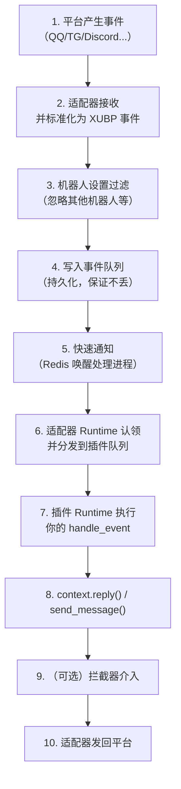

# 消息流转

> **你会学到**：一条消息从平台到达你的插件、再回复出去，中间经历了什么。

## 完整流转

## 各阶段说明

### 1. 平台产生事件

用户在 QQ / Telegram / Discord 等平台发消息、点按钮、加好友……平台通过 Webhook、WebSocket 或轮询把事件推给对应的适配器。

### 2. 适配器标准化

适配器把平台**原始的、格式各异**的事件，转换成统一的 XUBP 事件字典。这一步吸收掉所有平台差异——之后插件看到的都是同一种结构。

### 3. 机器人设置过滤

事件入队前，会经过机器人自己的设置过滤：

- 忽略其他机器人发的消息
- 忽略只 @了其他机器人的消息
- 忽略 @全体成员的消息
- 事件去重（防止平台重复投递）

被过滤掉的事件直接丢弃，不会进入队列、不会打扰插件。

### 4. 事件队列（持久化）

通过认证后的事件写入**持久化队列**。即使系统重启，未处理的事件也不会丢失。

### 5. 快速通知

事件入队后，通过 Redis 的流式通知**立即唤醒**等待中的处理进程，延迟极低。

::: tip Redis 是可选的
如果没有 Redis，系统会自动降级为数据库轮询模式——功能完全正常，只是事件唤醒稍慢一点。Redis 只影响性能，不影响正确性。
:::

### 6. 适配器 Runtime 认领与分发

适配器 Runtime 进程从队列里**抢占式认领**事件（谁先拿到谁处理，天然支持多节点扩展），然后按机器人和插件绑定关系，把事件分发到对应的插件队列。

### 7. 插件 Runtime 执行

插件 Runtime 进程认领属于自己的事件，按优先级依次调用各插件的 `handle_event(context)`。

### 8. 插件回复

插件调用 `context.reply()` 或 `context.send_message()` 发送回复。

### 9. 拦截器介入（可选）

如果机器人装了拦截器插件，发出的消息会先经过拦截器——拦截器可以**修改消息内容**或**阻断发送**。典型用途：敏感词过滤、消息审计、自动撤回。

### 10. 发回平台

最终消息经适配器发回平台，用户看到回复。

## 可靠性保证

| 机制 | 作用 |
|------|------|
| 持久化队列 | 事件不丢，重启可恢复 |
| 抢占式认领 | 多进程/多节点自然负载均衡 |
| Redis 降级 | Redis 挂了也能跑 |
| 进程自动重启 | 插件崩溃可配置自动拉起 |
| 事件去重 | 防止平台重复投递导致重复处理 |
| 孤立事件恢复 | 卡在处理中的事件超时后自动回收 |
| 并发控制 | 单插件最多同时处理若干事件，超出排队 |

## 下一步

- 理解完了流转，开始写插件 → [插件开发快速开始](../plugin-dev/getting-started)
- 想看插件能调用的全部接口 → [上下文 Context](../plugin-dev/context)
