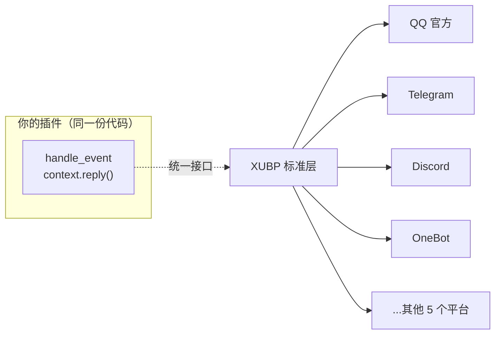

# XUBP 协议概览

> **XUBP** = **X**iaoyi **U**niversal **B**ot **P**rotocol（小依通用机器人协议）

## 什么是 XUBP

XUBP 是 V3 平台的**通用插件开发协议**。它定义了一套**与平台无关的标准接口**，让你只需编写一次插件代码，就能在所有已接入平台上运行——QQ 官方、OneBot、Telegram、Discord、KOOK、飞书、钉钉、微信公众号、企业微信。

## 核心思想：一次编写，多平台运行

不同平台的差异巨大——QQ 用 OpenID、OneBot 用 QQ 号、Telegram 用数字 chat_id、Discord 用 channel_id。如果插件要直接对接每个平台，代码里会塞满 `if 平台 == qq: ... else if 平台 == telegram: ...`。

XUBP 的做法是**把差异吸收进适配器**：

- **统一事件格式**：所有平台的事件，经适配器标准化后，插件看到的都是同一种结构。
- **统一回复方法**：`context.reply("你好")` 一行代码，自动适配每个平台的发送方式。
- **统一字段**：`context.sender_id`、`context.chat_id` 等属性，跨平台通用，插件不用关心底层 ID 是什么格式。

::: tip 插件开发者的心智模型
写插件时，**假装只有一个平台**。用 `context.reply()` 回复、用 `context.sender_id` 取用户、用 `context.chat_id` 取聊天空间。至于这条回复最终发到 QQ 还是 Telegram，由适配器处理，与你无关。
:::

## XUBP 提供了什么

| 能力 | 说明 |
|------|------|
| **统一事件类型** | 17 种通用事件类型（消息、机器人状态、交互、表态、审核），点分命名如 `message.group` |
| **统一事件结构** | 标准化的 event 字典，包含发送者、会话、内容、附件等 |
| **统一消息格式** | `send_message` 的 payload 格式，支持文本、富媒体、Markdown、按钮等 |
| **统一上下文** | Context 对象提供跨平台属性和回复方法 |
| **数据存储** | `data_store` 接口，按租户自动隔离 |
| **拦截器** | 可在消息发出前/后介入，实现内容过滤、审计等 |

## 学习路径

1. 先看 [事件类型](./events)——了解插件能响应哪些事。
2. 看 [消息流转](./message-flow)——理解一条消息如何从平台到达你的插件。
3. 进入 [插件开发](../plugin-dev/getting-started)——动手写第一个插件。

## 这份协议面向谁

XUBP 是**插件开发者**的协议。如果你想**新增一个平台适配器**（让 V3 支持一个全新的 IM 平台），那是平台内部能力，不包含在本公开协议内——请联系平台方。
